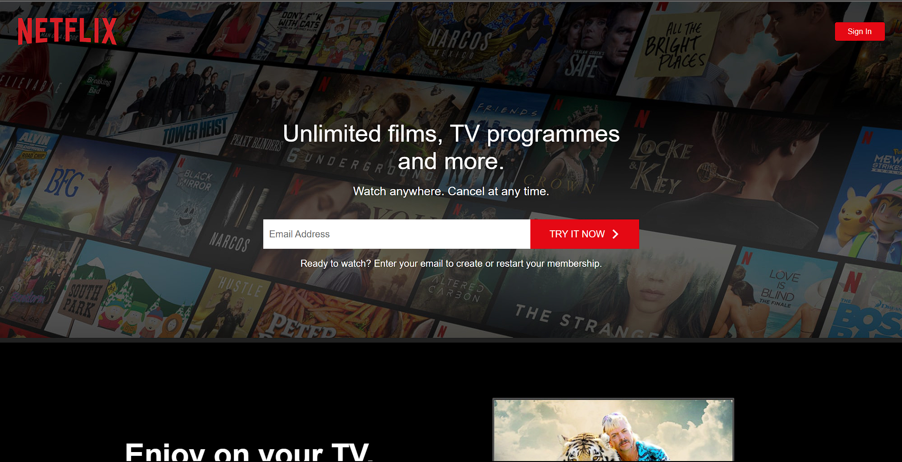
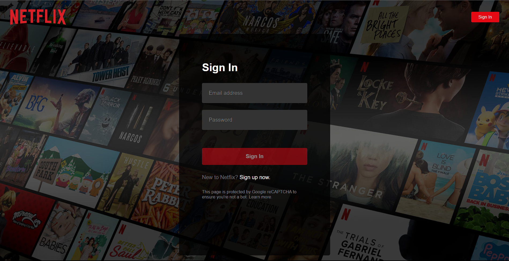
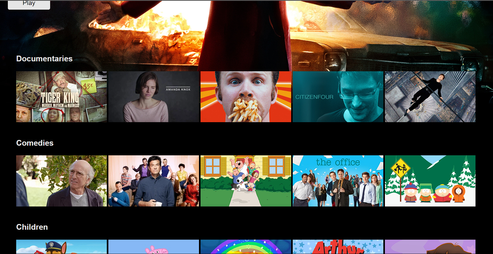
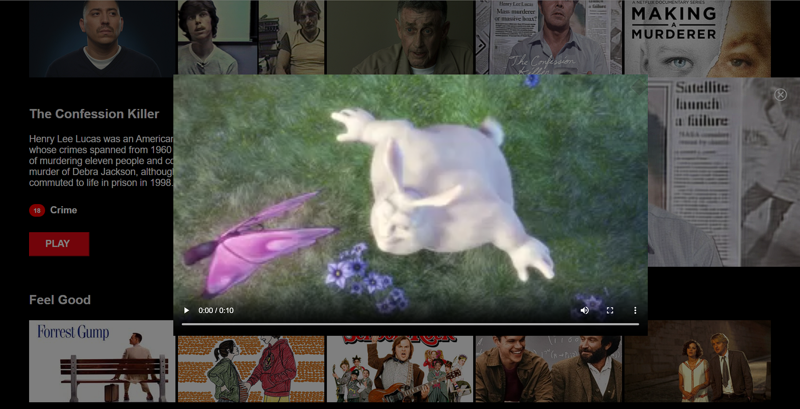

# Netflix Clone using React and Firebase

A Netflix clone project built with React and Firebase, featuring multiple pages like Home, Browse (with Firebase authentication), Sign In, and Sign Up. Users can sign in to their accounts, browse content, and enjoy a live search functionality using Fuse.js. Styled Components are used for all styling, and React Router handles navigation.

## Table of Contents

- [Features](#features)
- [Tech Stack](#tech-stack)
- [Installation](#installation)
- [Usage](#usage)
- [Screenshots](#screenshots)
- [Contributing](#contributing)

## Features

Experience the following features in this Netflix clone:

- Home Page with featured content
- Browse Page with Firebase authentication
- Sign In Page for user authentication
- Sign Up Page for new user registration
- Live search using Fuse.js
- Seamless navigation with React Router

## Tech Stack

This project leverages the power of these technologies:

- React (custom hooks, context, portals)
- Firebase (Firestore/auth)
- Compound
- Styled Components

## Installation

Follow these steps to set up and run the project on your local machine:

1. Clone the repository: `git clone https://github.com/Debarghya001/Netflix_Clone_Firebase.git`
2. Navigate to the project directory: `cd netflix-clone`
3. Install dependencies: `npm install`

## Usage

To run the project locally:

1. Configure your Firebase credentials in the project.
2. Start the development server: `npm start`
3. Open your browser and go to: `http://localhost:3000`

## Screenshots

*Homepage*

*Login Page*

## Contributing

Contributions are welcome! Feel free to create pull requests for bug fixes or enhancements. If you encounter any issues or have suggestions, please open an issue in the repository.

